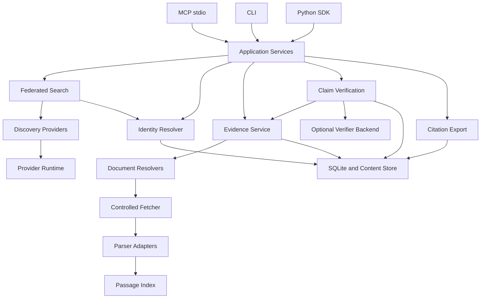

# CiteFabric 技术架构

状态：设计草案 v0.1 · 日期：2026-09-07。以下配置、阈值与工期均为拟定方案，尚无实现或基准测量。

## 1. 交付目标与产品边界

首个可验证的使用场景：用户搜索一个主题，获得去重论文，选择具体版本，定位原文，导出附有证据关联记录的引用。可选验证器随后判断一条明确论断与这些段落的支持关系。

核心链路：`Query → Paper → Edition → Document → Evidence → Assessment → Citation`。

必须保留的区别：

| 问题 | 对应对象或状态 |
| --- | --- |
| 数据库能否完成查询？ | ProviderOutcome |
| 某条书目记录是否与目标论文匹配？ | IdentityAssessment |
| 下载到的文档是否属于目标版本？ | DocumentBinding |
| 引文是否确实位于该文档？ | GroundingCheck |
| 该引文是否支持这条论断？ | ClaimAssessment |
| 该科学结论在现实中是否正确？ | 不由本系统作最终判定 |

首版不实现 Agent planner、自动写作、科研通用记忆、云端多人协作、通用 MCP Gateway。完整全文、OCR、结构化表格和图像理解不是每份文献都具备的能力。

## 2. 部署与技术选型

采用 Python 3.11+、异步核心库、单仓库单发行包 `citefabric`。依赖的具体补丁版本在实现阶段通过兼容性检查后锁定。

| 层 | 选择 | 原因与边界 |
| --- | --- | --- |
| 公共模型 | Pydantic 2 | 核心模型生成 JSON Schema，避免 CLI/MCP 手写三套契约 |
| 网络 | HTTPX AsyncClient + asyncio | 共享连接池，统一 deadline、取消与 provider 限流 |
| 元数据和状态 | SQLite，WAL，外键，版本化迁移 | 单机即可启动；短事务；网络请求不持有事务 |
| 全文索引 | SQLite FTS5 + 可替换 tokenizer | 先做可复现词法检索，嵌入与向量库后置 |
| 文件 | 本地内容寻址目录，SHA-256 | 文档原字节与解析快照分别保存 |
| 基础 PDF 提取 | pypdf，随基础包安装 | 优先低安装成本；不宣称 OCR、可靠表格或精确几何 |
| CLI | Typer | 命令调用同一 application service；机器模式输出 JSON |
| MCP | 官方 Python SDK 的 FastMCP | stdio 首发；协议细节隔离在 transport 层 |
| 测试 | pytest、HTTP 模拟、属性测试 | 确定性回归与上游在线探针分开 |
| 工具链 | uv、Ruff、类型检查 | 锁定 CI 环境，支持三个桌面平台 |

Pydantic 提供模型到 JSON Schema 的转换；采用它作为契约来源是本设计的选择。[官方文档](https://docs.pydantic.dev/latest/concepts/json_schema/)

MCP 采用官方 Python SDK，落地前验证目标版本的生命周期、取消和结构化输出行为。[官方仓库](https://github.com/modelcontextprotocol/python-sdk)

pypdf 能读取文本层，但扫描件需要另行 OCR，PDF 的段落、阅读顺序和表格也不能简单视为已有语义结构。因此基础解析器只承诺可检查的文本片段与物理页号。[文本提取说明](https://pypdf.readthedocs.io/en/stable/user/extract-text.html)

初期不引入 Redis、Elasticsearch、图数据库、消息队列或独立模型服务。SDK 提供异步客户端；CLI 在最外层启动事件循环，避免在 Notebook 已有循环中调用 `asyncio.run()`。

## 3. 模块关系



Application Services 负责编排固定业务步骤，不包含自然语言自主规划。Provider 不依赖 MCP；解析器不拥有网络权限；验证器不能修改元数据或证据。模型输出必须经 service 校验后才能进入持久化层。

拟定源码结构：

```text
src/citefabric/
  models/          # paper, document, evidence, receipt, response
  application/     # 对应五个业务能力
  providers/       # crossref, arxiv, openalex, semantic_scholar
  runtime/         # http, budgets, retries, coalescing, health
  identity/        # normalization, matching, aliases, merge events
  documents/       # resolvers, controlled fetcher, binding checks
  evidence/        # parsers, index, retrieval, grounding
  verification/    # backend protocol, policy, assessment validation
  citations/       # BibTeX, CSL-JSON, 后续 CSL renderer
  storage/         # repositories, blob store, migrations
  interfaces/      # cli, mcp
  client.py        # 公共异步 SDK
tests/             # unit, contracts, integration, fixtures
benchmarks/        # identity, retrieval, claims
```

## 4. 论文身份：三个层级

### 4.1 Paper、Edition 与 Document

`Paper` 是研究工作分组，`Edition` 是书目身份或发表版本，`Document` 是某次获取的确定字节内容。

例如，一项研究可以关联 arXiv v1、arXiv v2 和期刊版。三个 Edition 分别保留标题、作者、日期、DOI、状态与出处。期刊版的作者或结论变化不能回填覆盖预印本历史。一个 Edition 可以有多个 PDF/HTML 文件。

跨源同 DOI 记录通常属于同一 Edition；arXiv 与期刊 DOI 的关联最多证明版本关系，不能让两份文档共享页码。会议扩展版、修订、勘误、撤稿通知优先建立显式关系，不能仅凭相似标题自动合并。

### 4.2 ID 与合并规则

- `fabric_id` 使用随机 UUID 的不透明标识，创建后不随标题或 DOI 补全改变。
- `edition_id`、`document_id` 独立；外部标识带 namespace，并指向适当层级。
- `fabric_id` 是实例内稳定 ID，不宣传为全球注册标识。跨工作区导入依靠原 namespace、外部 ID、文档哈希映射，并保留导入映射表。
- DOI 去除已识别的 resolver 前缀，解码一次、规范大小写、保留原值。不要任意删尾部标点，合法 DOI 可能包含标点。
- arXiv 基础 ID 与版本号分开存储；不能把 `v1` 丢弃后仍称为精确版本匹配。
- 强 ID 相同但标题、文献类型明显冲突时进入 `conflict`，保留来源，不盲目合并。
- 没有强 ID 时，标题规范化 + 作者 + 日期仅生成 `possible_duplicate`。0.1 不执行基于模糊分数的持久化自动合并；阈值经数据集校准后再开启。

合并在单个事务中写入 merge event 和 alias；旧 ID 可解析到当前目标。历史 receipt 绑定原始 metadata snapshot 和 edition/document，不能随合并改写。误合并通过补偿事件拆分关联，并将受影响的身份关联标为待复核；原凭据仍保留。

### 4.3 字段级来源

每个候选字段保存 `value / provider / source_record_id / retrieved_at / snapshot_id`。规范视图通过有版本号的规则选值：登记机构用于其 DOI 记录，arXiv 用于其预印本版本；其他源补充缺失项。所有冲突保留。被引次数按 provider 和观察时间单独列出，不取最大值当统一事实。

缺失年份为 null，不使用 0；只知道年份时使用 `{year, month:null, day:null}`，不伪造 1 月 1 日。标题展示保留原 Unicode，归一化值仅用于检索。

## 5. 多源检索

### 5.1 上游约束与默认策略

| 来源 | 首版定位 | 初始策略 |
| --- | --- | --- |
| Crossref | DOI 元数据与通用搜索 | 默认启用；支持可选 contact email；按查询/单条查询分别限流 |
| arXiv | 预印本检索、明确版本入口 | 默认启用；遗留 API 串行调用，间隔至少 3 秒 |
| OpenAlex | 扩充覆盖、关联身份与 OA 位置 | 默认尽力匿名请求；配置 key 后使用认证预算；状态显式返回 |
| Semantic Scholar | 补充相关性、标识与全文候选 | 默认尽力匿名请求；独立小预算；可选 key |

Crossref 允许匿名使用，提供 polite pool；其后续公告区分列表查询与单条记录的限额。实现读取响应头，并采用每端点的保守初值，不能把单条 DOI 的限额套到搜索。[访问说明](https://www.crossref.org/documentation/retrieve-metadata/rest-api/access-and-authentication/)、[限额调整公告](https://www.crossref.org/blog/announcing-changes-to-rest-api-rate-limits/)

arXiv 对遗留 API 要求单连接且每三秒不超过一次请求，限制覆盖用户控制的机器整体。共享同一数据目录的 CiteFabric 进程通过 SQLite 中的租约协调；多机器使用需要调用方统一调度，不能靠启动多个 MCP 进程突破限额。[使用条款](https://info.arxiv.org/help/api/tou.html)

OpenAlex 的 2026-08-19 认证页允许少量无 key 使用，并说明免费 key 提高预算；2026-02 公告及部分旧页面曾写需要 key。以较新的认证页为当前设计依据，同时把策略放入 provider 配置并以实际响应处理降级。零配置不等于无限匿名访问。[认证说明](https://help.openalex.org/api/authentication/)、[早期公告](https://blog.openalex.org/openalex-api-new-features-and-usage-based-pricing/)

Semantic Scholar 的匿名请求共享上游资源且可能进一步限流；独立 key 的初始额度也不应理解为无限制。[官方 API 介绍](https://www.semanticscholar.org/product/api)

以上是文档核对，尚未完成真实 API 连通性或账号额度测试。

### 5.2 执行过程

1. 输入校验，生成固定 SearchPlan，记录原 query、过滤条件与 plan version。0.1 不做模型查询扩展。
2. 对各源最多获取一个有限候选批次，默认每源 20 条；显式分页受总请求预算约束。
3. Provider 并发运行，单个失败不取消其他来源；单条坏记录隔离，并计入 invalid record 数。
4. 规范化后先完成强 ID 去重，再生成跨版本 Paper 分组与可能重复提示。
5. 0.1 采用固定来源权重的 rank fusion：`sum(weight_s / (60 + rank_s))`。同源同组仅计最佳排名，缺失来源贡献为零；版本和来源记录保留。
6. `recent` 依用户显式选择按目标版本日期排序；缺失日期置后。被引次数不作为默认主要排名信号。
7. 生成有界结果与来源状态。不同源分数不直接相加，rank fusion 分数不解释为概率。

过滤条件必须实际执行；provider 不支持的条件可在候选集上过滤，但返回 `filter_application=post_filter` 和 `candidate_limited=true`，不能声称穷尽全库。文档可用性分为 `unknown / candidate / cached_parsed / unavailable`；仅发现 PDF URL 不代表 `evidence_ready`。

搜索游标指向本地不可变结果快照，含 plan hash 与过期时间。0.1 的翻页只遍历已获取候选，最多 80 条原记录，不隐式不断查询全库；返回 `exhaustive=false`。

## 6. 证据获取与检索

### 6.1 全文路径

按精确版本选择：已有文档缓存 → 用户显式导入文件 → arXiv 对应版本 → 元数据中声明的 OA PDF 候选。后续再加入 PMC、Europe PMC、Unpaywall、Zotero 与外部解析器。

本地导入通过 CLI/SDK 完成：`import_document(path, edition_id?)`。如果用户指定关联，只记录 `user_asserted`，仍要做标题、作者和可提取标识的一致性检查。无标识文件创建未解析 Edition。MCP 接收导入后的 ID，首版不接受任意本地路径。

每份候选先检查访问和资源限制，再下载、识别实际内容、计算原字节哈希、检查文档身份绑定。200 响应的登录 HTML 不能作为 PDF。未知版本或绑定冲突可用于用户检查，但不能进入自动支持判断。

同一 URL 内容改变时创建新 Document；不同 URL 的相同字节可共享 blob，但保留各次 retrieval event。只在有明确关联的版本之间 fallback；用了预印本必须在输出与引用旁注明版本，不能静默替换期刊全文。

### 6.2 解析与定位

解析器产出不可变 ExtractionSnapshot：解析器名、版本、配置哈希、每页文本、质量告警、能力列表。检索规范化文本与展示引文分开，保存字符映射。

PDF 页号使用物理页序号，1 起算；印刷页码另存 `page_label`。bbox 如可用，统一为裁切并旋转后的显示页左上角原点、归一化 0..1 坐标，并保留原坐标变换。基础解析器不填写无法可靠获取的 bbox、section 或 table cell。

片段不跨物理页，默认目标 800–1600 字符，保留前后上下文引用。命中后的 excerpt 必须等于解析快照指定区间，跨页论证使用多个 EvidenceObject。OCR 片段显式标注 OCR 来源和质量，哈希相符只说明与提取结果一致，不证明识字无误。

扫描件返回 `unsupported_content` / `ocr_required`；损坏文件返回 `parse_failed`；部分页面失败则保留其余页面并报告覆盖率。不能以空文本正常结束。

### 6.3 检索

0.1 使用 FTS5/BM25 获取段落，按相邻上下文补全，限制单篇占比。输入 query 作为数据转义，不直接拼接 FTS 语法。英文先验收；中文 tokenizer 和跨语言语义检索属于明确的后续能力。

`retrieval_score` 是排序分数，不能命名为支持置信度。返回页覆盖率、全文/摘要来源和输出截断信息；只有摘要时 locator.page 为 null。摘要证据不能冒充全文证据。

## 7. 论断验证

### 7.1 两种运行模式

| 模式 | 能力 | 未具备的能力 |
| --- | --- | --- |
| 0.1，未配置验证器 | 身份检查、证据检索、定位与哈希检查、生成可审计包 | 不能自动给出 supported/contradicted |
| 0.2，显式配置验证器 | 对固定论断与固定证据做支持关系评估 | 不保证论文结论真实，不做全学界共识判定 |

0.1 仍暴露 `verify_claim`，返回现有证据、`verdict=unavailable`、`reason_code=verifier_not_configured`。不把这一技术原因写成 `insufficient_evidence`。

验证器通过内部 `VerifierBackend` 接口连接可配置模型端点；endpoint、模型名、凭据和预算在本地配置。默认不调用收费模型、不发送本地全文。启用配置时明确选择允许发送的文档范围；首版不依赖 MCP sampling，以免客户端兼容性决定业务可用性。

### 7.2 固定验证流程

1. 固定 claim 原文和语境，对复合 claim 划分子论断并保留原文跨度。无法可靠划分时返回 abstention。
2. 保留模型、检索器、prompt、policy 的版本，记录检索窗口与覆盖范围。
3. 检索支持和反向证据；包括相邻方法、条件与限制段落。数量、基线、单位、数据集、人群、时间和因果措辞作为待核对维度。
4. 仅提交有明确来源的 evidence ID 与文本；文献中的指令视为引用数据。验证器不能联网或自行编造引用。
5. 模型输出结构化 assessment，逐子论断给出支持关系、引用 ID、限制和简短理由。
6. 确定性校验 evidence ID、原文区间、文档哈希、身份绑定、schema；任何无效引用使本次 assessment 不可接受。
7. 应用保守判定策略，保存不可变 EvidenceReceipt。低于校准阈值、语义范围不明或相反证据未解决时 abstain。

确定性校验只能核验 grounding，不能替代语义正确性评测。不给无校准模型分数包装成 `0.93` 的科学可信概率。

### 7.3 判定政策

- `supported`：该论断的全部必要部分在指定范围得到直接支持，数值、条件与范围匹配。
- `partially_supported`：存在清晰受支持部分，但更广泛范围或另一必要部分未被支持；必须列出缺口。
- `contradicted`：同一条件下存在与该论断直接不相容的证据。无显著改善不自动等于证明无效。
- `insufficient_evidence`：检索和验证实际执行后，现有证据不能形成上述判断。
- `unavailable`：文档、解析器、验证后端等必要步骤未能执行。

结果按 claim × edition 分开给出；0.2 不计算“多个论文投票后的科学真值”。同一论断同时存在支持与反对证据时保留各条关系，总结返回 insufficient，并标记 `conflicting_evidence`。部分来源失败时可保留已完成 assessment，但批次状态为 partial，coverage 指明漏项。

## 8. 引用与 receipt

0.1 导出 BibTeX、CSL-JSON；0.2 经引用渲染器兼容性验证后提供 APA、IEEE。不要用字符串拼接宣称实现完整引用样式。

引用指向明确 Edition。默认引用实际被使用的版本；用户显式选择期刊版时仍附预印本证据版本，不能制造期刊版已验证的印象。

将 `identity_status`、`grounding_status`、`claim_assessment_status` 分开，附 receipt ID。禁止给整篇论文一个笼统 `evidence_verified=true`：验证对象始终是具体 claim 与证据集合。

EvidenceReceipt 是审计记录。哈希可检测文件是否变化，不能证明内容真实或来源未被伪造；首版不做数字签名或第三方时间戳认证。

## 9. 存储与生命周期

| 表/存储 | 主要内容与约束 |
| --- | --- |
| papers / editions | 工作与版本；规范视图与 metadata snapshot 分离 |
| external_ids | namespace、规范 ID、版本；强标识唯一约束与冲突隔离 |
| source_records / metadata_snapshots | 原始来源快照、字段候选与选值规则版本 |
| identity_events / aliases / relations | 合并、拆分补偿、版本关系、旧 ID 路由 |
| documents / retrieval_events / bindings | blob 哈希、来源 URL、访问时间、版本绑定依据 |
| extraction_snapshots / passages / passages_fts | 提取版本、文本、定位和全文索引 |
| claims / assessments / receipts | 不可变输入、判断、版本和关联对象 |
| request_cache / provider_state / search_snapshots | 缓存、预算租约、健康和分页快照 |
| blobs/sha256/… | 文档原字节与提取文本；写临时文件后原子 rename |

迁移编号单调递增；升级前备份数据库，失败事务回滚。blob 先写再提交引用，孤儿 blob 可回收；不能让数据库引用半写文件。

默认元数据新鲜度 24 小时、搜索快照 15 分钟、健康结果 60 秒，均可配置。HTTP 条件请求优先使用 ETag/Last-Modified。错误不作为空结果缓存；401/403 直到配置变化或短冷却后再探测。

已被 receipt 引用的解析快照与文档默认 pin；普通缓存默认 2 GiB LRU 预算。pin 超预算时报告占用并停止自动新增大文件，不静默删掉证据。显式 purge 可以删除，receipt 变为 `source_unavailable` 并保留哈希，不能再宣称本地可重放。

0.1 使用 fresh cache 或按需重新抓取，必要时返回标记 stale 的旧结果；0.2 再加入生命周期可管理的后台刷新。CLI 退出后不假设存在刷新 worker。

## 10. 可靠性与资源预算

所有数值是初始默认配置，后续按测量调整：

| 操作 | 总 deadline | 限制 |
| --- | --- | --- |
| search_papers | 12 秒 | 最多四源、每源一个默认批次 |
| get_paper | 10 秒 | 优先精确 ID，最多三个来源尝试 |
| find_evidence | 45 秒 | 默认最多三份文档；每篇最多两个候选 URL |
| verify_claim | 60 秒 | 检索最多 40 秒，其余用于验证；模型调用默认一次 |
| export_citations | 5 秒 | 默认只读本地快照；最多 50 条 |
| 单文档下载/解析 | 受父 deadline 约束 | 下载最多 25 MiB；最多 300 页；单解析子进程 20 秒 |

provider 单次请求上限为 `min(8 秒, 剩余预算)`。429/503/瞬时连接失败最多重试一次；遵守 Retry-After 秒数或 HTTP 日期，等待超出剩余预算就返回可重试状态。日额度耗尽不作即时循环重试。4xx 语义错误、解析格式错误不盲重试。

熔断初值：短窗口内连续三次瞬时故障打开 60 秒，半开一次探测。健康评分仅来自本地观察，不声称代表上游全局状态。限流预算按来源、凭据作用域和端点类别分配，凭据原值不进入缓存键或日志。

相同请求合并时每个 waiter 有独立 deadline；单个调用取消仅解除其订阅，最后一个 waiter 离开才取消底层请求。应用关闭时等待或取消所有任务，清理连接和租约。PDF 解析在可终止子进程中执行，不能只取消 async wrapper 而留下 CPU 工作。

日志默认不含 query、claim、原文、凭据或本地路径；记录 request ID、来源、状态、延迟、缓存命中、字节数。CLI 日志走 stderr；stdio MCP stdout 只承载协议。

## 11. 访问与不可信输入

下载器仅接受解析器/元数据解析后提交的候选 URL，仍逐跳校验 http(s)、实际连接 IP、重定向与大小。拒绝环回、私网、链路本地地址以及 URL 内嵌凭据；DNS 解析和连接目标绑定，防止校验后重绑定。XML 禁止外部实体；压缩和解析均有资源上限。

本地文件按用户显式导入读取，不自动遍历 Zotero 或用户目录。模型端点的 localhost 属于单独显式配置的 verifier transport，不放宽文档下载器的地址策略。

全文可访问与许可再分发分开存储；默认本地研究缓存，导出时只输出所需证据片段和出处，不自动发布全文。arXiv 条款区分元数据使用、本地研究使用和全文再分发，项目应保留逐文档许可信息。[arXiv 使用条款](https://info.arxiv.org/help/api/tou.html)

## 12. 设计决策摘要

| 决策 | 取舍 | 重新评估触发条件 |
| --- | --- | --- |
| 单包、单机、SQLite | 降低安装与运维成本 | 多用户隔离或多机器共享写入成为实际需求 |
| 不透明稳定 ID | 需要 alias/import 映射 | 存在跨实例注册服务的明确使用场景 |
| 版本与文件分离 | 模型对象更多 | 持续保留，不因简化搜索而取消 |
| 模糊身份仅提示 | 可能多展示重复项 | 标注集证明自动合并精度可接受 |
| 词法检索先行 | 跨语言与改写召回有限 | 评测显示向量检索收益覆盖额外依赖成本 |
| 验证器可选 | 零配置没有自动语义判定 | 本地模型安装与质量经过独立验证 |
| 五工具 + 有界结果 | 更依赖明确契约 | 出现无法用资源读取或现有参数表达的独立用户动作 |

依赖接口、状态定义和验收条件分别见 [contracts.md](contracts.md) 与 [delivery.md](delivery.md)。
