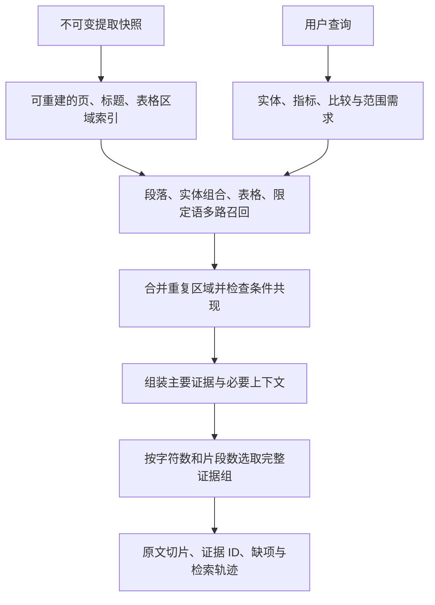

# 检索 v3 设计：条件化表格定位与预算内保留限定语

状态：已据此实现实验性 `structured_v3` 并完成第三轮实验，默认仍为 v2。日期：2026-09-08。下文原设计保留为决策依据；实际范围与差异见本节补充。

**当前实现与设计的差异：**

- 存储为两个派生表及一个 FTS 索引，术语匹配按查询计算，没有独立术语倒排表或完整章节树。固定构建规则由 builder version 标识，运行 manifest 另外保存源码哈希；构建参数尚未暴露为配置 API。
- 表格、图注和限定段通过原文模式识别；没有可靠单元格恢复、脚注关系验证、跨页表格拼接或显式页眉频率过滤。因此证据组的关系与完整性保守标为 unassessed，不输出“条件已证实”。
- 普通解释性问题保留 v2 词法召回，使用紧凑上下文与显式表格引用补全。结构化通路先按角色与条件排序，再按版本公平选择、合并连续范围。通过收缩可选扩展给引用表格腾出预算，保持原始命中种子。
- 默认紧凑预算为 `min(max_chars, 6000)`；明确缺项或表格引用可使用调用者更大的预算。上下文不是自动填满 max_chars。原文字符预算与 MCP JSON 字节上限分别执行。
- 索引按需构建，限制 300 个 text unit、300 万字符、6000 个派生块，构建/检索阶段有 10 秒协作式超时。页间可取消，提交原子化；同步 SQLite 语句本身不提供硬抢占。历史结构块保留，旧索引搜索行退出 FTS 以避免重复统计。
- 已运行两种预算下的 v2/v3、中英文四组真实 MCP 检查，以及关闭上下文/关闭词汇表的中文消融。另有 30 条合成条件/范围/预算变体和 9 项工程回归；尚未增加新的独立盲测论文集。

最终实测、验收门槛与剩余问题见 [第三轮报告](../output/validation/round3/report.md)。以下数值配额和阶段目标若与实现有差异，以代码和报告为准。

目标是在现有 SDK、CLI、MCP 和精确原文证据契约之上，改善带数据集/方法/指标条件的表格定位，并让关键限定语在有限字符预算内进入返回证据。本阶段保持本地执行；语义 verifier 仍不在本方案内。

## 1. 根因：需要调整选择单位，而不只是扩大召回数量

对第二轮同一数据库重放当前 v2 候选排序，得到以下结果。这里参考页只用于诊断，不参与查询。原始记录保存于 [diagnostics.json](../output/validation/round3_design/diagnostics.json)。

| 题目 | 当前候选内的实际位置 | 失败环节 | 设计对应措施 |
| --- | --- | --- | --- |
| Q17 英文 | 第 7 页表头片段 BM25 排第 5；前四中两段来自第 8 页 | 每版本最多四个种子，正确页没有进入最终选择 | 按表格/页面合并候选，多条件匹配优先，再施加输出预算 |
| Q17 中文 | 正确页在 48 个候选中排第 39 | 通用“误差”概念覆盖主导排序，实体组合的重要性不足 | 独立实体组合召回及区域内共现评分 |
| Q19 中文 | 正确片段 BM25 第 7、重排第 5；前四中两段来自第 5 页 | 候选选择丢失比较的一侧 | 训练成本与推理成本分别召回，按比较证据组选择 |
| Q20 中文 | 第 44 页后半段重排第 2，前半段第 11 | “未来工作”命中，关键限制段未进入返回上下文 | 限定语作为需要单独覆盖的证据角色，先分配预算 |
| Q31 中文 | 第 8 页后部片段已是第 2 | 同页前部的检验范围未保留，其他页面消耗预算 | 在已命中的主题/章节内定向提取限定段 |

因此，“Q17 没召回正确页”需要精确表述为：**正确页未进入最终证据，实际已进入候选集**。只把 48 个候选扩大到更多，不能解决其英文失败；只把每篇四段改成六段，也无法解决中文第 39 名及表头/末行分离的问题。

当前代码还先按约 1400 字符切片，再选择四个种子，最后尝试扩成整页。Q17 第 7 页的抽取文本中，表题、表头、基线行与 TIMEGUARD 行出现在页首约 1700 字符的区域，具备用紧凑表格原文解决的可能；这只是可行性依据，尚不是 v3 已修复的实测结论。

## 2. 推荐方案与交付范围

采用 **“页与结构块索引 → 多路候选 → 条件重排 → 证据组装 → 双预算选择”**。



第一阶段交付可定位的表格区域与原文上下文，优先覆盖表题、表头、目标行、基线和适用范围。**不依赖自动恢复二维单元格才能提供正确原文**。对于读序失真或行列无法确定的 PDF，输出明确的结构不确定提示；不能把文本中的第几个数字直接当成某个指标值。

可靠的单元格提取属于后续增强：只有文本结构明确或带可验证坐标的解析器提供可靠行列关系时，才产出单元格定位。该增强需要单独测试集和解析器选型实验，本方案不预先承诺某个第三方解析器能解决所有表格。

## 3. 数据层：不可变原文之上的派生结构

新增可重建索引，不修改既有 `ExtractionSnapshot`、`EvidenceObject` 和回执。

| 对象 | 必要字段 | 用途 |
| --- | --- | --- |
| `StructureIndex` | extraction_id、text_hash、builder_version、config_hash、status、coverage | 标识构建规则与覆盖范围，防止跨快照混用 |
| `StructureBlock` | block_id、unit_id、start/end、kind、parent_id、heading_refs、flags | 表示连续原文范围：标题、段落、表题、表格区域、表头候选、行候选、注释 |
| `TableRegion` | region_id、caption_refs、header_refs、body_refs、note_refs、structure_status | 关联同一张表的原文块；首版不是二维矩阵 |
| `TermOccurrence` | normalized_term、block_id、原文 token 范围、role_hint、basis | 在原文中定位实体、指标与术语；角色不明确时保留 unknown |
| `EvidenceBundle` | requirements、成员 evidence_id 与角色、missing_requirements、selection_basis | 查询相关的证据组合，属于检索结果，不写入原文证据对象 |

建议 SQLite 增加 `structure_indexes`、`structure_blocks`、`structure_regions`、`structure_terms` 及派生 FTS 索引。页级索引也引用原始 text unit，避免复制为新的“提取版本”。精确表结构与查询结果不混在同一个存储对象中。

关键约束：

- 所有原文块属于明确的 `extraction_id + text_unit_id`，范围为原文字符偏移；搜索用大小写、Unicode 或连字符归一化不能修改原文。
- 归一化 token 保留对应原始 token 范围。长度变化时不能拿归一化偏移切原文。无法建立映射时，只返回已知原文块范围。
- 区域关联允许多个块，但每个证据仍是单页连续切片。跨页表格只能形成多个证据对象；首版不自动认定相邻页就是同一张表。
- `structure_status` 使用 `text_region / ambiguous / unsupported` 等结构状态，不叫“可信度”。没有可靠坐标时，不填写 `Locator.cell` 或 bbox。
- 识别依据可审计：例如表题模式、编号标题、连续数值行、显式注释。缺少表题时，数值密集区域只能标为候选，不能自动升级为确定表格。
- 正文引用“Table 3”与真正表题分开。识别出的重复页眉保留在原文展示中，但不参与区域条件共现计分；多栏读序和参考文献编号需要标记，不可靠标题不用于强制过滤。

同一张表的可见相邻行、列头和脚注可能在提取文本中分离。只有区域边界清楚时才自动建立关系，否则退回整页候选并标记歧义。宁可保留不确定性，也不生成错误的行列配对。

## 4. 查询计划：先保住显式条件

保留现有 `query_plan`，扩展为如下内部计划：

```json
{
  "original": "PEMS03/BackTime 条件下 TimeGuard 带来多大误差变化？",
  "literal_terms": ["PEMS03", "BackTime", "TimeGuard"],
  "metric_terms": [],
  "intent_hints": ["comparison", "quantitative_result"],
  "requirements": ["primary_result", "comparison_context", "measurement_context"],
  "inferred_roles_are_soft": true,
  "semantic_translation": false
}
```

这是拟议输出示例，不表示这些字段已存在。计划不凭空填入用户未提供的模型、基线、具体数字或表号。“误差变化”可触发比较上下文需求，但不能直接假定比较对象就是 No Defense；优先返回完整短表或同表中可见的比较选项。

排序时区分三类信息：

1. **原查询中的显式实体和指标。** 保留 PEMS03、BackTime、MAE_C 与 MAE_P 的区别。同一表格中多个显式条件共现优先于只命中 TimeGuard 论文名。
2. **从文档结构推断的角色。** 表题中出现的实体可能是数据集，表头中的实体可能是攻击方法；这些是带依据的软提示，不作为未经验证的硬过滤。
3. **通用科研词汇。** “误差、训练、结果”等辅助召回。它们的覆盖不能让缺失 PEMS03/BackTime 的候选超越同区域明确匹配多个实体的候选。

别名只做有限、可解释的规范化。例如 `MAE_C` 与明确对应的 `MAEC` 可以关联；不能合并 MAE_C 与 MAE_P，也不能擅自认为带后缀的两个数据集名称等价。中文专业术语扩展与这个结构改进分开评测，不把 Q28 的词汇缺失归因于表格模块。

对“任意、所有、保证、是否意味着、是否证明”等表达，增加 `scope_context` 需求；对训练/推理、开发/测试、平均/每个模型等对照，生成两个待检索方面。这些规则只是帮助找到相关条件，不输出逻辑判断。

## 5. 多路召回与条件重排

每个已选版本独立建立候选，保留现有段落 FTS 作为一条通路。初始配额是工程起点，必须在新开发集冻结后验证：

| 通路 | 每版本初始配额 | 查询对象 |
| --- | ---: | --- |
| 原有段落词法检索 | 32 | 原查询与有限词汇扩展 |
| 页级实体组合 | 12 | 跨切片分布的显式实体；组内别名 OR，实体组间 AND |
| 表题/表格区域检索 | 12 | 表题、表头、行候选中的实体、指标与比较关系 |
| 限定语/比较另一侧检索 | 8 | 相关章节中的范围、限制、指标定义及比较条件 |

总初始候选最多 64/版本；最多三个版本时总计 192。未启用通路的配额可以回借。若缺失显式条件，仅允许一次有记录的放宽或补查，累计上限 128/版本、384/请求，并服从操作 deadline。内部 FTS 表达式由经过转义的 token 构建，不执行用户传入的 FTS 语法。

召回顺序可采用实体组合 AND → 单一实体或子集回退，但回退后必须记录哪些实体未覆盖。某个条件没找到只能标记 `not_found_in_candidates`，不能声称全文不存在。

**先分组，再限额。** 按版本、提取快照和表格/段落区域合并重复命中。同一页的多段不会因为占掉四个名额而让正确页被提前淘汰。也不简单强制每页只留一段：同一页可能有两张表或两个互补段落。

首版采用可解释的分层排序，而不是随意混合不同索引的 BM25 数值：

1. 显式条件在同一区域的覆盖与确定冲突；只在同页不同表出现的条件视为较弱匹配。
2. 与任务需求的匹配：表格数值、方法解释、成本对照、范围条件。
3. 结构关系是否清楚、证据是否能在预算内成组返回。
4. 各通路的名次融合及有限通用词汇覆盖；保存通路内名次，不把不同 FTS 表的原始分数直接相加。
5. 稳定的来源范围顺序作为平分时的排序依据；不依赖新建数据库的随机 UUID 决胜。

“正文比附录好”不能作为普遍硬规则。查询未指定单模型时，可软优先同条件的主结果；用户明确问单模型、消融或附录配置时，相关附录应优先。检测到 PEMS04 与查询 PEMS03 的冲突，也只有在角色和表格范围可靠时才能强降权。

## 6. 表格证据：按依赖关系组装

一个可审阅的定量结果通常需要：**表题/实验条件 + 列头/指标单位 + 目标行 + 比较行 + 必要脚注**。它们组成一个证据组。

针对 Q17，理想结果是返回第 7 页表 3 的连续原文区域，保留 PEMS03、BackTime 列组、MAE_C/MAE_P 方向、No Defense/TIMEGUARD 行，以及“三个预测模型的平均结果”的表题说明。这里表号和页码只用于验收说明，不能进入实现规则。

组装策略：

- 短表：整块原文优先。Q17 这一类表无需扩展到整页正文。
- 长表且边界明确：表题、全部相关表头、匹配行及脚注形成多个精确切片；同页切片之间距离小且合并后不超预算时，可以连中间原文一起返回。
- 目标行不明确：保留候选行或完整表格，不猜测比较基线。
- 多级表头、单位或脚注关联不明确：`structure_status=ambiguous`；可返回表格原文供审阅，但不得宣布行列条件完整。
- 跨页或整表大于预算：提供可容纳的完整部分并列出缺失角色；不把孤立数字标成完整证据。

首版不自动计算百分比或得出 supported/contradicted。后续若增加计算，每个输入必须绑定到实际证据和确认的行列关系，并保存公式；这属于另一个可独立验收的能力。

## 7. 限定语与字符预算：先组成完整证据，再选组合

将当前“先选高分片段，再用剩余预算扩整页”改成“先识别必要证据角色，再按成本选择证据组”。

限定语候选来源包括：

- 已命中段落附近的范围、否定、比较条件和指标定义。
- 同主题的 Limitations、Discussion、适用条件章节；Future work 单独分类，不能替代 Limitations。
- 表题/脚注中的 averaged、per-model、dataset split、interval、units 等条件。
- 与查询主题相关的 `consistent with`、`within`、`no evidence for` 等检验边界表述。

要求候选与查询实体、当前证据或可靠章节关系相关。仅因为全文某处包含 “however” 或 “limitations” 就拿来填预算，会引入无关内容。候选字段命名为 `scope_context`，不命名为“反证”或“证明不足”。

Q20 应优先保留限制段的完整语义单元；Q31 应检索检验范围，而非只拿 Conclusion。Q19 则需要同时覆盖训练和推理两个方面。是否真的构成限制或反例，仍由人工或将来的 verifier 判断。

**双预算规则：**

- `max_chars` 统计所有唯一返回证据的原文字符；重叠切片尽量合并，未合并时按实际返回字符计算。字符数不等于 token 数，也不等于 MCP JSON 字节数。
- `max_passages` 仍限制实际返回的 EvidenceObject 数量，而不是证据组数；`bundles` 只引用 hits 中已返回的 ID，不重复附带原文。
- v3 取消“先选四个种子”的阶段性上限，按版本公平分配完整证据组。只有一个版本时可以使用调用者指定的全部片段预算；多个版本时先尝试各给一个可用组，再分配剩余预算。
- 表格组内可靠关联的表头/行/单位先作为依赖集合考虑；对范围敏感查询，主要结果和已找到的相关限定语一起参与选择。无可用限定语时记录 `not_found`，不能伪装成已覆盖。
- 每组生成有限的紧凑版、含邻近上下文版、完整区域版。先选能覆盖需求的紧凑版，预算有余再扩展。
- 初始实现使用确定性的贪心选择与一次交换：优先新增尚未覆盖的需求，其次相关性，最后比较增量字符成本。若必需上下文放不下，可用较小的完整证据组替换低收益大块；不承诺数学最优。
- 不硬性永久预留固定百分比给限制句；不存在相关限制时，预算可用于主要证据。对确实需要的角色则不能先被整页扩展消耗殆尽。
- 不在数字、否定词或依赖从句中间截断。分句不确定时保留较完整段落。必要段落本身超预算时报告缺口，而不是制造短小但失真的引文。

如果只容得下表头却放不下目标行，返回可审阅候选并标记 `missing_requirements=["target_row"]`。若连完整可用片段都放不下，返回空 hits，并用现有 OutcomeStatus 的 `partial` 和专用 code `context_budget_exceeded` 区别于真正没有候选；统一结果聚合需增加相应回归测试。缺页、结构歧义和预算不足也分别记录，不统称为“无证据”。

## 8. API 与证据完整性

首版只新增一个策略参数：

```python
await client.find_evidence(
    papers=[selector],
    query="PEMS03/BackTime 条件下 TimeGuard 带来多大误差变化？",
    retrieval_policy="structured_v3",  # 拟新增；实验阶段显式启用
    max_passages=6,
    max_chars=6000,
    expand_query=True,
    include_context=True,
)
```

`retrieval_policy` 初始取 `v2 | structured_v3`，默认保持 v2，达成验收后再评估默认切换。`expand_query=False` 关闭语言词汇扩展，但仍可提取原查询显式实体；`include_context=False` 保留新召回/排序，只返回主要片段并标记上下文策略关闭，不能声称依赖齐全。

暂不增加强制用户填写 dataset/model/baseline 的复杂表单。内部先从查询提取可审计的软约束；将来明确需要结构化条件输入时再扩展契约。

新增结果元数据示意：

```json
{
  "retrieval_version": "3",
  "structure_index_version": "1",
  "bundles": [{
    "bundle_id": "...",
    "evidence_ids": ["..."],
    "requirements": ["primary_result", "comparison_context", "measurement_context"],
    "roles": {"...": ["primary_result", "comparison_context", "measurement_context"]},
    "requirements_status": "complete",
    "assessment_scope": "declared_retrieval_requirements_only",
    "missing_requirements": [],
    "structure_status": "text_region"
  }],
  "selection_trace": {
    "candidate_limited": true,
    "relaxations": [],
    "returned_chars": 1800,
    "returned_passages": 1
  }
}
```

该示例的数字与状态用于说明字段，不是实验结果。`complete` 仅表示列出的检索需求已有原文覆盖，不等于数值行列已核验，更不等于论断成立；不确定行列必须留在 `structure_status` 中。

输出还应说明每个条件属于 `matched_in_region / matched_only_on_page / not_found_in_candidates / ambiguous` 哪一种，并保留原文依据。检索轨迹只列有限候选 ID、来源通路、选择原因和丢弃原因，不复制候选全文；MCP 继续沿用 128 KiB 内联上限与分段资源协议。

新片段继续通过现有精确切片与哈希验证生成 EvidenceObject。复用已有相同范围证据时保留其 ID；新范围使用版本化、确定性的 ID 生成规则。同一原文证据用于不同角色时，仅改变 bundle 元数据。禁止给历史 EvidenceObject 追加 query-specific 角色、修改 locator 或重写回执；旧 ID 与原始绑定继续可读。

## 9. 索引构建、迁移与模块分工

新增 `structure.py` 负责派生结构，`evidence_selection.py` 负责需求和预算。保留 `retrieval.py` 的查询扩展，将召回/排序扩展放在可独立测试的函数中，`client.py` 只编排。

| 模块 | 拟改动 |
| --- | --- |
| `storage.py` | 数据库迁移、派生索引读写、多通路查询、版本过滤 |
| `structure.py`（新增） | 页/标题/表格区域/术语定位，保存识别依据与歧义 |
| `retrieval.py` | 查询需求、实体组合召回、区域分组和条件重排 |
| `evidence_selection.py`（新增） | 证据组、依赖检查、字符/片段预算与缺项 |
| `models.py` | 策略输入、内部结构模型与可解释结果字段 |
| `client.py` / `cli.py` | 策略编排与参数透传；保留 v2 路径 |
| `mcp_server.py` / schemas | 输入 schema、大小限制与新字段资源检查 |
| 实验脚本 | 策略与预算参数、分阶段诊断、角色完整性指标 |

现有数据库仅支持 `user_version=1`，不能直接改初始化 SQL 而忽略已有工作区。实施时增加编号迁移与事务回滚，升级前使用数据库一致性备份。新表附加于现有证据存储；旧代码无法打开新版 schema 时，回退使用备份或隔离数据库，不承诺直接二进制降级。

导入后构建新快照的派生索引；历史文档可在首次选择 v3 时按需构建。构建在受 deadline 控制的工作单元中执行，解析计算不持有写事务，完成后原子写入 ready 状态；并发相同索引使用唯一键和复用结果，不能暴露半完成结构。构建失败保留旧索引和原文，可退回 v2 并明确 `structure_index_unavailable`。

索引键包含 extraction_id、text_hash、builder_version 和 config_hash。构建限额、耗时、峰值内存、块数上限需要实测后冻结；超限时覆盖信息显示 partial，不能声称扫描了整篇。旧提取、文档与回执不重解析、不删除。

## 10. 实验与验收

下面是拟定门槛，不是已达到的结果。必须同时比较 **产品默认 6000 字符** 与上一轮 **12000 字符**；max_passages 均为 6，固定同一语料、查询、快照与归一化设置。

实验顺序：v2 → 仅分组/选择改进 → 加页/表结构召回 → 加限定语证据组 → 完整 v3。通过消融区分收益来自新召回、去重、角色覆盖还是仅返回更多文本。单独记录候选中有正确页但最终未选中的情况。

| 指标 | 定义与验收要求 |
| --- | --- |
| 旧锚点覆盖 | 12000 字符下，英文至少维持 35/36，中文至少维持 29/36；已命中题不得静默回退 |
| 重点失败题 | Q17/Q19/Q20/Q31 的中英文完整上下文均作为开发验收目标；未达标必须列明失败阶段 |
| 表格条件覆盖 | 不只检查数字，还检查数据集、攻击/模型条件、列头、基线、单位/聚合说明；人工逐项标注 |
| 限定语覆盖 | 检查相关限制、否定、统计范围是否保留；同时标注限定语是否与主要证据相关 |
| 对照污染 | PEMS03/PEMS04、MAE_C/MAE_P、训练/推理、平均/单模型、开发/测试互换时，不能把相同片段无条件标为需求完整 |
| 默认预算表现 | 6000 字符下重点题应可提供紧凑完整证据；与 v2 同预算比较，不借用 12000 字符结果作宣传 |
| 字符成本 | 12000 上限下，完整 v3 平均字符相对 v2 至少降低 25% 为初始目标，同时达到覆盖门槛；不强行缩短复杂必要原文 |
| 可重放与边界 | 每个证据精确切片、各版本不混用、预算不超、旧 ID/回执不变；新工作区比较内容而非随机 ID |
| 工程行为 | SDK/CLI/MCP 一致；索引失败/取消/并发构建/迁移恢复/资源分段均有测试 |

阶段性基线来自 [第二轮报告](../output/validation/round2/report.md)，不是独立测试集。下一轮另建 `benchmarks/round3`，增加条件替换、真实反例、跨页/多级表头、字体乱码、非表格问题及不存在的配置。人工标注者必须看原文，不能把输出命中率当作标签来源。

建议新增至少 30 条任务：约 12 条条件对照、10 条限定语/比较、8 条结构与预算边界；开发题和未用于调参的评估题分开。合成 PDF 用于偏移、行列和跨页边界测试，真实论文用于检索质量；二者分别报告。由同一助手设计和审阅的题组仍不得称为独立盲测。

## 11. 实施顺序与决策点

1. **阶段 A：诊断与结构索引。** 补齐候选轨迹、派生结构、迁移与兼容测试。可审阅产物是原文块/表格区域/条件定位，不以命中率代替结构检查。
2. **阶段 B：条件召回与证据选择。** 去除提前四种子截断，合并区域，多路查询，组装短表，先解决 Q17/Q19；对图表结构不可靠的情况明确降级。
3. **阶段 C：限定语与预算。** 引入比较/范围角色、紧凑证据组与替换选择，解决 Q20/Q31，增加 6000 字符对照。
4. **阶段 D：冻结并复评。** 完成消融、新题评估与真实 MCP 检查；达到覆盖和成本门槛后才考虑将 v3 设为默认。若收益主要来自更多文本或条件错误增加，则继续保留实验策略。

这条路线直接针对现有失败位置，同时保留后续接入布局解析器或语义 verifier 的空间。首先要交付的是“更准确地找出并完整呈现可审阅原文”，其效果由分阶段实验检验。
